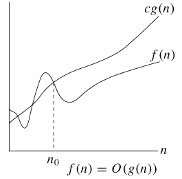

Big-O
=====

### Definition

-	점근적 상한선(Asymptotic upper bound)
-	주어진 알고리즘이 아무리 나빠도 비교하는 함수와 같거나 좋다.
-	**O(g(n)) = f(n) (There exist positive constant c and n0 such that 0 <= f(n) <= cg(n) for all n >= n0)**



> n0 기준으로 n0보다 오른쪽에 있는 모든 n값에 대해 함수 f(n)은 함수 cg(n)보다 작다는 의미. 그래프가 아래애 있을 수록 수행시간이 짧은 것이므로 성능이 좋다.

==> 알고리즘의 최악의 성능을 표시해주지만 많이 사용하는 이유는 아무리 최악의 상황이라도 이정도의 성능을 보장할 수 있다라는 것을 보여주기 위해 사용.

### O표기법

#### Example

```c++
void main() {
  int sum = 0;
  for (int i = 0; i <= 100; i++) {
    sum += i;
  }
  std::cout << "sum = " << sum << std::endl;
}
```

**<각각의 코드가 실행되는 횟수>** 코드 | 실행 횟수 -------|------- void main() {} | 0번 int sum = 0; | 1번 for(int i = 0; i <= 100; i++) {} | 102번 (100번돌고 마지막에 한번더 확인하고 루프나옴) sum += 1; | 100번 std::cout \<< ... \<< std::endl; | 1번

==> 총 204번 실행됨. O(204)로 표기 그러나 O표기법에서 상수의 존재는 알고리즘 성능에 아무런 영향을 끼치지 않음. 그래서 O(1)로 간단히 표시함.

-	만약 100번이 아닌 N번 실행된다고 한다면 이때 표기법은 O(N)이 될 것이다.
