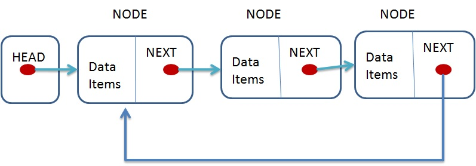
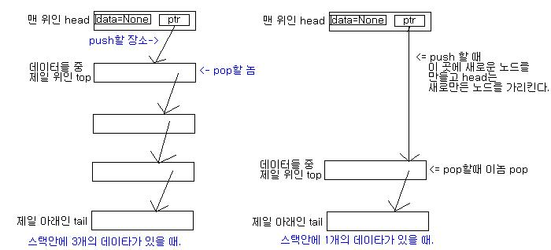
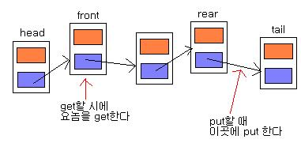
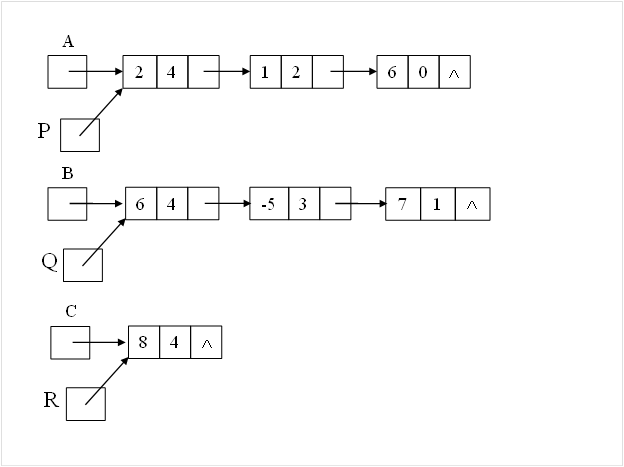
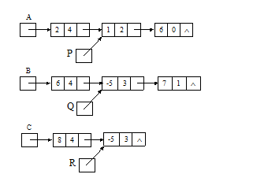
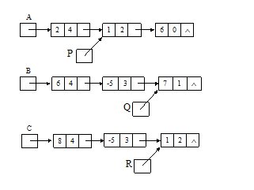
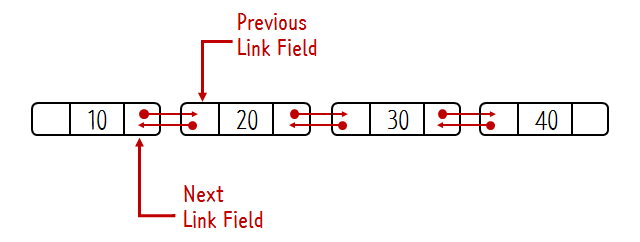
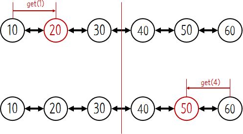
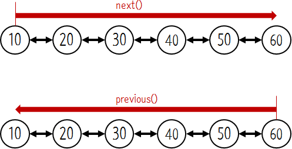

Linked list
===========

### 연결 리스트

-	자료구조 종류 중 하나로 어떤 데이터를 저장할 때 다음 자료가 있는 위치를 포함시키는 방식으로 자료를 저장
-	동적할당을 이용하여 필요할 때마다 길이를 늘리고 줄일 수 있다.

### 단순 연결 리스트(체인)


-	노드가 하나의 링크 필드에 의해서 다음 노드와 연결되어 있는 리스트

**노드와 리스트부분 구현**

```c++
class List; //전방선언

class Node {
friend class List;
private:
  int data;
  Node* next;
};

class List {
private:
  int countIndex;
  Node* head;
};
```

### 원형 연결 리스트(Circular Linked List)

- 어따쓰는지, 장점,



-	마지막 노드가 첫 노드와 연결되어 있는 리스트

**노드와 리스트부분 구현**

```c++
class List; //전방선언

class Node {
friend class List;
private:
  int data;
  Node* next;
};

class List {
private:
  int countIndex;
  Node* tail;
};
```

### 가용 공간 리스트(Available Space List)

-	선형 연결 리스트
-	자유 노드 리스트를 두고, 새로운 노드가 필요할 때 자유 노드 체인을 검사??????

- malloc에 관한 내용

### 연결리스트로 구현한 스택



**배열로 구현한 스택과 연결리스트기법을 추가한 스택의 차이**

1.	연결리스트는 논리상의 오버플로우가 없다. 즉, 자료를 무한대(컴퓨터상의 메모리 한계까지)로 삽입, 출력이 가능하다는 말
2.	삽입, 출력이 배열보다 간편하다.

**스택을 연결리스트로 구현해야 하는 이유??**

1.	큰 프로젝트에서 대량의 용량으로 구현한 스택을 필요로 하기 때문에
2.	push나 pop이 편하기 때문에 (입출력 간편)

### 연결리스트로 구현한 큐



**배열로 구현한 큐와 연결리스트기법을 추가한 큐의 차이**

1.	연결리스트로 구현한 큐는 오버플로우가 없다.
2.	삽입, 삭제가 번거롭지 않다. 다만 속도가 조금 느려짐
왜 느려지나?, 속도좌우하는 애 머냐

### 단순연결리스트를 이용한 다항식

목적???
수식을 넣어서 이해시켜라

-	다항식의 노드는 **계수(coef), 지수(expon), 링크(link)** 필드로 구성
-	두 개의 리스트 a, b에 각각 다항식 노드를 연결하고 a와b의 항들을 따라 순회하면서 각 항들을 더하면 됨.

**a와 b가 가리ß키는 항의 지수에 따라 3가지 경우**

1.	a.expon == b.expon : 새로운 항을 만들어 다항식 리스트 c에 추가
2.	a.expon < b.expon : b항을 다항식 리스트 c에 추가하고 b만 다음 노드로 이동
3.	a.expon > b.expon : a항을 다항식 리스트 c에 추가하고 a만 다음 노드로 이동

2x^4 + x^2 + 6
6x^4 - 5x^3 + 7x

 

-	두 리스트중 하나가 NULL이 될때까지 반복, 둘 중 하나가 NULL이 되면 남은 다항식 노드는 다항식 리스트 c에 전부 추가

### 원형연결리스트를 이용한 다항식

-	0인 다항식이 연산과정에서 문제를 일으키기 때문에 특수 경우로 처리해야함. 그래서 각 다항식에 헤더(header)노드를 도입
-	???

### 이중 연결 리스트(Double Linked List)



-	노드와 노드가 양방향으로 연결되어 있는 리스트

**장점**

-	노드의 반은 next를 이용해 탐색하고, 반은 previous를 이용해 탐색 -> 탐색해야하는 element가 반으로 줄어듬



-	노드를 탐색하는 방향이 양쪽으로 가능하다



**단점**

-	이전 노드를 지정하기 위한 변수를 하나 더 사용 -> 메모리를 더 많이 사용한다
-	구현이 조금 더 복잡해짐
