Tree
====

### Tree?

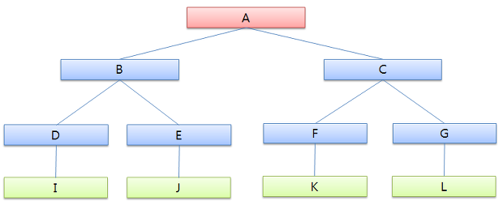

-	계층적 구조(비선형 구조)를 띄고 있는 자료구조
-	주된 목적 => **탐색**
-	의사결정, 파일 시스템(디렉토리 구조), 검색 엔진, DBMS, 라우터 알고리즘, 계층적 데이터를 다루는 등 매우 다양한 곳에서 응용

| 용어         | 설명                                                                       |
|--------------|----------------------------------------------------------------------------|
| 차수(degree) | 어떤 노드가 가지고 있는 자식 노드의 수 (예 : A 노트 차수 2, B 노드 차수 2) |
| 레벨(level)  | 트리의 각 층의 번호 (예 : 레벨 1은 A, 레벨 2는 B)                          |
| 높이(height) | 트리의 루트 노드부터 시작하여 맨 끝에있는 잎 노드까지의 깊이 (예 : 깊이 3) |

### Binary Tree

-	노드는 최대 2개의 자식 노드를 가질 수 있는 자료구조
-	이진트리에는 여러 형태가 존재

**Complete Binary Tree**

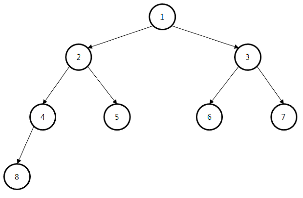

-	어떤 잎 노드 두개의 레벨차가 1 이하이며, 왼쪽부터 오른쪽으로 채워지는 트리

**Skewed Binary Tree**

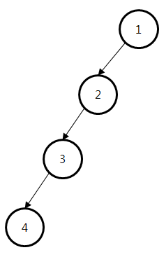

-	루트 노드를 제외한 모든 노드가 부모 노드의 왼쪽 자식노드이거나 혹은 오른쪽 자식 노드인 트리
-	즉 노드 방향이 한쪽 방향으로만 치우쳐져 있음

**Full Binary Tree**

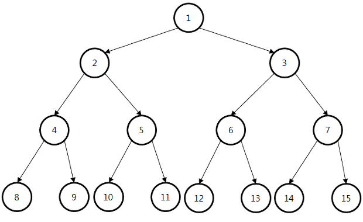

-	최대한 노드가 가득차있는 트리
-	모든 노드가 자식 노드를 2개나 가지고 있다
-	모든 포화 이진 트리는 완전이진 트리 (역은 성립하지 않는다)

### Tree Traversal

**Preorder Traversal**

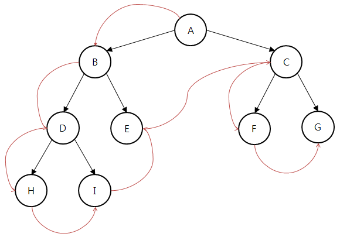

-	루트 노드를 시작으로 아래로 내려오며 좌측 하위트리를 먼저 방문하고, 방문이 끝나면 우측 하위 트리를 방문

**Inorder Traversal**

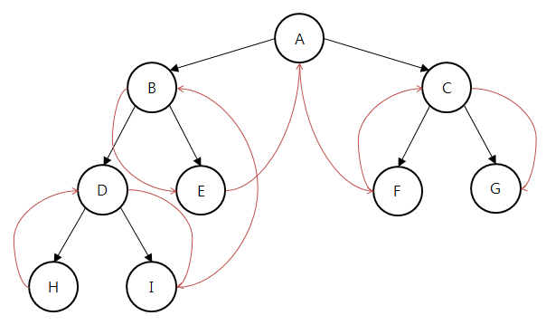

-	좌측 하위 트리부터 시작하여 루트 노드를 거치고 우측 하위 트리를 방문

**Postorder Traversal**

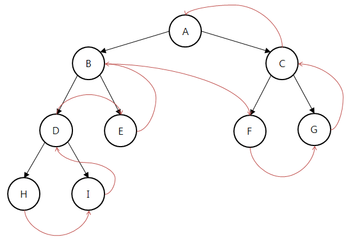

-	좌측 하위 트리부터 시작하여 우측 하위트리를 거치고 마지막으로 루트 노드를 방문

**Levelorder Traversal**

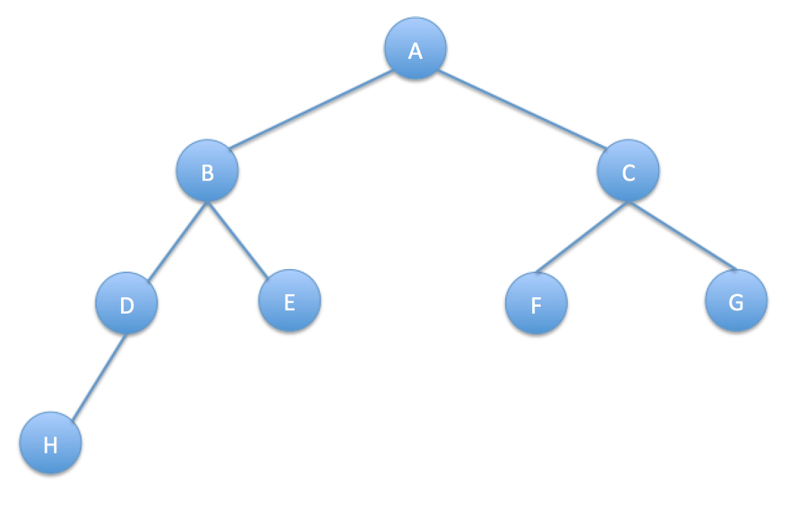

-	루트 노드부터 시작하여 레벨 순서대로 차례로 각각 방문
-	A -> B -> C -> D -> E -> F -> G -> H

### Thread Binary Tree

-	스택을 이용하지 않고 포인터를 이용하여 순회의 시간을 단축시기는 방식
-	스택공간을 쓸 수 없거나, 부모 노드의 위치를 알 수 없을 때 유용하게 사용

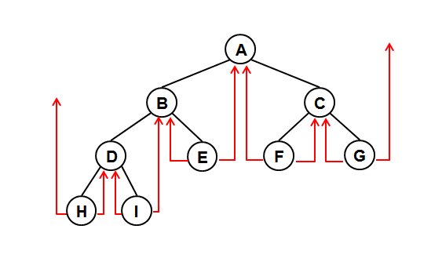

-	스레드는 말단 노드(Leaf Node)에만 적용
-	**중위 선행자** :: 중위 순회를 할 떄 현재 노드를 방문하기 전이었던 노드를 의미
-	**중위 후속자** :: 중위 순회를 할 떄 현재 노드 다음 순회 할 노드를 의미

이 트리의 중위순회 : H->D->I->B->E->A->F->C->G - H의 중위 선행자, G의 중위 후행자는 없다. 그래서 root라는 dummy node를 만들어 포인팅을 도와줌

**이 포인터를 만드는 이유** 1. 노드의 위치를 잃지 않고 저장하기 위함 2. 스레드 이진트리의 정의를 명확하게 하기 위함

### Heap

-	최댓값 및 최솟값을 찾아내는 연산을 빠르게 하기 위해 고안된 Complete binary tree를 기본으로 한 자료구조

**최대힙** :: 부모노드의 키값이 자식노드의 키값보다 항상 큰 힙

**최소힙** :: 부모노드의 키값이 자식노드의 키값보다 항상 작은 힙 -> 오로지 자식노드 간에만 성립

#### 우선순위 큐

-	들어간 순서에 상관없이 우선순위가 높은 데이터가 먼저 나온다
-	데이터를 근거로 우선순위를 판단 및 목적에 맞게 우선순위를 프로그래머가 판단해서 결정

**우선순위를 구현하는 방법**

1.	배열을 기반으로 구현하는 방법
2.	연결리스트를 기반으로 구현하는 방법
3.	힙을 이용하는 방법 -> 삽입 O(lng n), 삭제 O(log n)

=> 1번과 2번은 삽입 시 한칸씩 밀어서 삽입을 해아하는 점, 배열과 연결리스트 공통으로 삽입 또는 삭제시 전체 데이터를 비교할 수도 있다는 점 때문에 주로 3번을 이용한다. => 데이터양 적으면 많은 차이 없지만, 데이터양 많아질 수록 O(n)과 O(log n)은 엄청난 차이가 남

**힙을 기반으로 우선 순위 큐를 구현**

< 데이터 저장 >

**최소힙**

숫자가 작을수록 우선순위가 높다고 가정

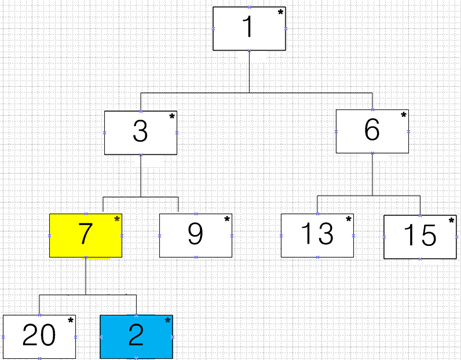

새로운 데이터는 우선순위가 제일 낮다는 가정하에 마지막 위치에 저장

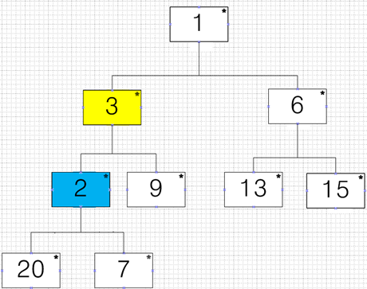

부모 노드인 7과 비교한 후 위치를 서로 바꾼 후 부모노드 3과 비교

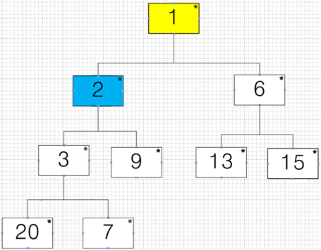

부모 노드인 3과 위치를 바꾼 후 부모노드 1과 비교 이때 2는 1보다 우선순위가 낮으므로 바꾸지 않음.

< 데이터 삭제 >

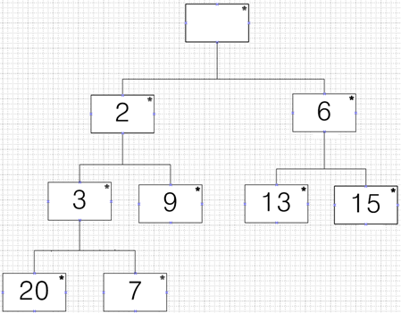

우선순위 큐의 삭제는 가장 높은 우선순위의 데이터 삭제를 의미

마지막 노드를 루트 노드의 자리로 옮긴 뒤 자식 노드와 비교

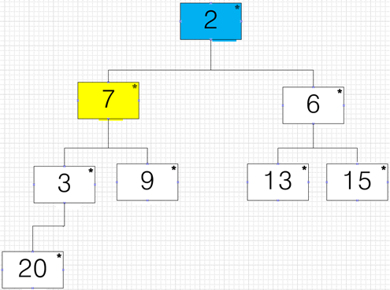

두 개의 자식 노드 중 우선 순위가 높은 노드와 교환을 해야 함

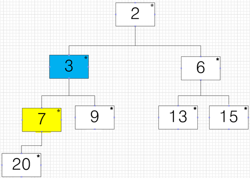

이 때는 우선 순위가 높은 3과 비교후 자리를 바꿈

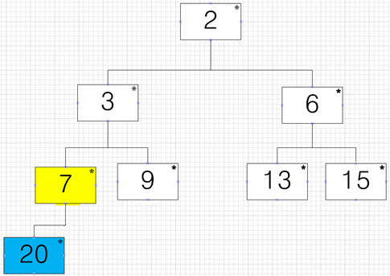

자식노드 20과 비교 하면 우선순위가 7이 더 높으므로 자리를 바꾸지 않음

### Binary Search Tree

**속성**

1.	각 노드에 값이 존재
2.	값이 중복된 노드가 없음
3.	노드의 왼쪽 서브트리에는 해당 노드의 값보다 작은 값들을 지닌 노드로 구성
4.	반대로 노드의 오른쪽 서브트리에는 해당 노드의 값보다 큰 값들을 지닌 노드로 구성
5.	좌우의 서브트리는 다시 각각 이진 탐색트리여야 함

탐색, 삽입, 삭제 => O(log n) 성능 보장
