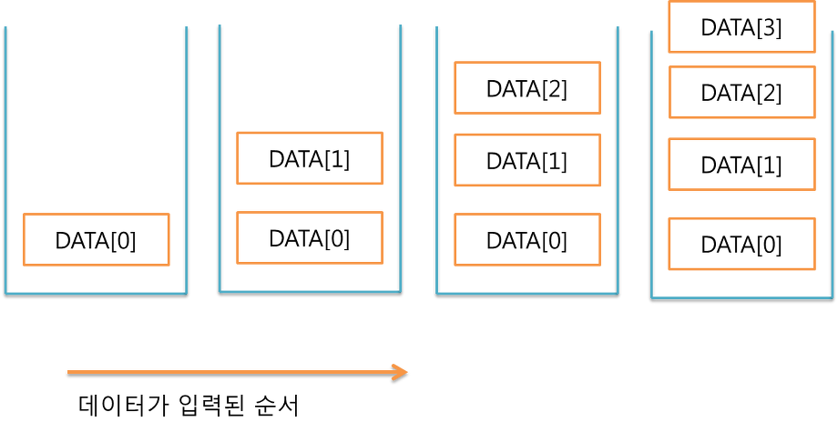
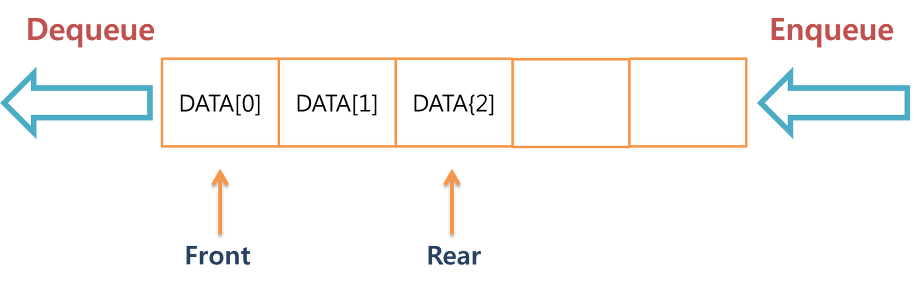
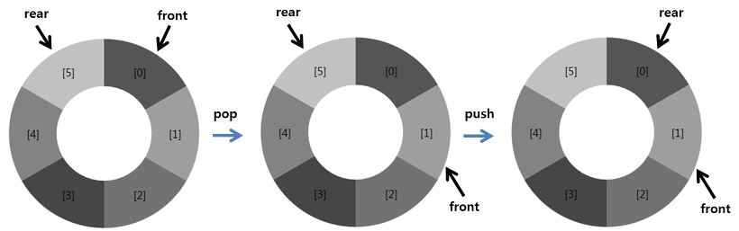

Stack and Queue
===============

### Stack



-	무언가를 쌓는다라는 의미를 갖는 자료구조
-	넣는 방향성 ▼ 빼는 방향성 ▲ - 일반적으로 **Last In First Out** (후입선출)이라 부름
	-	사용되는 함수로는 Push와 Pop이 있음 (Push는 입력, Pop은 삭제)

##### <예외처리 부분>

-	스택에 자료가 없을 때 Pop을 하면 자료가 없기에 뺄 것도 없음. 이때 Err를 **Stack Underflow** 라고 함
-	스택의 크기, 배열의 크기 이상의 자료를 Push할 때도 들어갈 공간이 없으므로 Err 발생시킴. 이때 Err를 **Stack Overflow** 라고 함

```c++
template <class T>
class Stack {
 public:
	 Stack(int stackCapacity = 10);
	 bool IsEmpty() const;
	 T& Top() const;
	 void Push(const T& item);
	 void Pop();
	 ~Stack(){}

 private:
	 T* stack;
	 int top;
	 int capacity;
};

Stack<T>::Stack(int stackCapacity) : capacity(stackCapacity) {
	if (capacity < 1) {
		throw "Stack capacity must be > 0";
	}
		stack = new T[capacity];
		top = -1;
}
Stack<T>::~Stack() {
	delete [] stack;
}

bool Stack<T>::IsEmpty() const {
	return top == -1;
}

T& Stack<T>::Top() const {
	if (IsEmpty()) {
		throw "Stack is empty";
	}
		return stack[top];
}

void Stack<T>::Push(const T& x) {
	if (top >= capacity - 1) {
		return -1;
	}
	stack[++top] = x;
}

void Stack<T>::Pop() {
	if (IsEmpty()) {
		throw "Stack is empty. Cannot delete";
	}
		stack[top--].~T();
}
```

### Queue



-	대기 행렬, 줄을 서서 기다리다의 의미
-	넣는 방향성 ◀ 빼는 방향성 ◀
-	스택과 반대로 **First In First Out** (선입선출)이라 부름

##### <예외처리 부분>

-	큐에 자료가 없을 때 Pop을 하면 자료가 없기에 뺄 것도 없음. 이때 Err를 **Queue Underflow** 라고 함
-	큐의 크기, 배열의 크기 이상의 자료를 Push할 때 들어갈 공간이 없으므로 Err 발생시킴. 이때 Err를 **Queue Overflow** 라고 함

##### <문제점>

-	먼저들어온 데이터가 Pop이 되면 다른 데이터들을 차례대로 땡겨주어야 함 (소수의 자료인 경우 상관이 없지만 많은 데이터의 경우 연산에 많은 시간 소요) ==> 해결하기 위해 나온 것이 원형 큐, 순환 큐, 환형 큐 라고 불리움.



-	배열을 직선으로 보는게 아니라 원형으로 보는 것
-	배열을 가득 채우지 말고 배열의 길이가 n일 경우 n-1개 채워졌을 때 가득찬 것으로 함

-	F와 R이 같은 위치를 가르킬 때 : 원형 큐가 텅텅 빈 상태

-	F가 R이 가리키는 위치의 앞을 가리킬 때 : 원형 큐가 가득 찬 상태

### 수식

-	사람들은 중위 표기법을 쓰고 컴파일러는 후위 표기법을 사용
-	스택이 사용됨 why? 연산자가 피연산자보다 나중에 계산되기 때문

| 중위 표기법  | 후위 표기법  |
|--------------|--------------|
| 1. a + b     | 1. a b +     |
| 2. a - b * c | 2. a b c * - |
| 3. a * b + c | 3. a b * c + |

1.	중위표기식 a - b * c가 입력값으로 들어왔을 때 a는 곧바로 출력, 연산자 -는 후위 표기법에 따라 스택에 저장 다시 b 출력, * 는 다시 스택에 저장, c는 출력 ---> 기본적으로 가장 나중에 들어온 연산자가 가장 먼저 출력되어야 함 그러므로 LIFO인 스택을 사용함

2.	1번처럼 했다가는 b + c가 먼저 계산되는 것처럼 됨. 그래서 이 문제를 해결하기 위해 연산자에 우선순위를 두게 됨.
